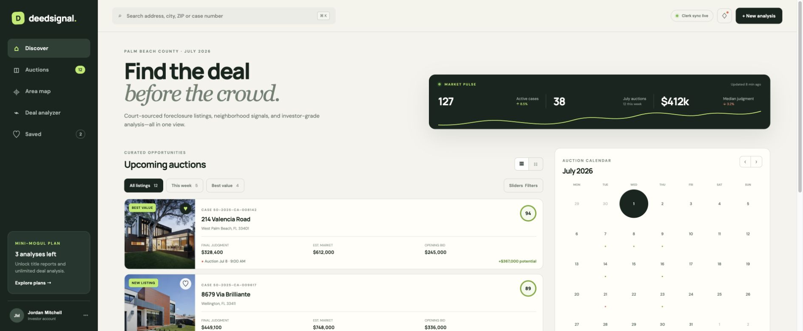
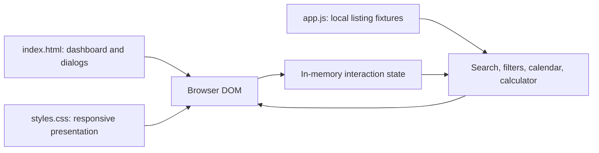

# DeedSignal

A dependency-free product prototype for exploring foreclosure and auction opportunities in Palm Beach County. Search, property details, an auction calendar, an illustrative area map, and a quick bid calculator are combined in a responsive dashboard.

**Status:** browser-only demo. Listings, case numbers, scores, market statistics, dates, and account information are illustrative fixtures. There is no live clerk sync, authenticated account, payment integration, or backend.



Screenshot captured from the unchanged public application on October 8, 2026. Displayed accounts, market values, listings, and freshness indicators are fixtures.

## Implemented interactions

- Search listings by address, city, ZIP, or case number.
- Filter by the preset “This week” and “Best value” flags.
- Open property details and toggle saved properties in memory.
- Browse months and select calendar days.
- Inspect fixed area pins and their scores.
- Calculate `max(0, ARV × 0.70 − renovations − holding/closing costs)`.
- Open membership and analysis dialogs.

The advanced-filter chips, drive-report requests, saved-analysis confirmations, and plan-selection messages are demonstrations. They do not submit requests or persist records.

## Architecture



Keeping HTML, CSS, and JavaScript separate makes the prototype easy to serve and inspect. Listing rendering and event handlers live in `app.js`; no build tool or package installation is required.

## Run locally

```bash
git clone https://github.com/OmElMon/DeedSignal.git
cd DeedSignal
python3 -m http.server 4173 --bind 127.0.0.1
```

Open [localhost:4173](http://localhost:4173). The HTML references Google Fonts, and CSS references Unsplash photos; these external assets require network access. The photos illustrate the UI and are not verified photographs of the fixture addresses.

## Validation

The repository has no automated tests, package manifest, or CI workflow in the inspected tree. A JavaScript syntax check is available if Node.js is installed:

```bash
node --check app.js
```

For this documentation update, JavaScript syntax validation passed. The existing UI was run locally: searching “Wellington” narrowed the visible listings to one fixture, and changing ARV from $610,000 to $700,000 changed the calculated ceiling from $330,000 to $393,000 with the other inputs unchanged.

Manual checks: search for a fixture city and an unmatched term, toggle a saved property, switch layout, open and close dialogs with Escape, navigate calendar months, and change each calculator input. The initial calculator values yield $330,000.

## Known limits

- Saved properties reset on reload. No database or browser-storage persistence is implemented.
- The calendar starts in July 2026 and uses fixed auction-day numbers; headline counts and “today” labels are demo values.
- The map is an illustration with positioned pins, not a geographic mapping integration.
- “Clerk sync live,” freshness labels, tier pricing, account identity, and market metrics are presentation fixtures.
- Toast messages for saving analyses, drive reports, and checkout do not establish completed actions.
- Modal focus handling and reduced-motion behavior need further work.
- A live product would require authorized data sources, provenance, authentication, persistence, validated analysis inputs, and real integration error handling.

No deployment, financial outcome, performance metric, or active user claim is made.
